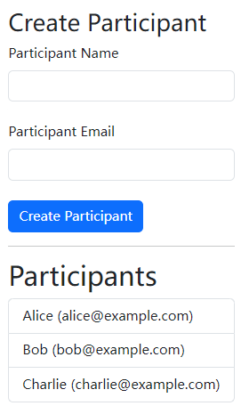
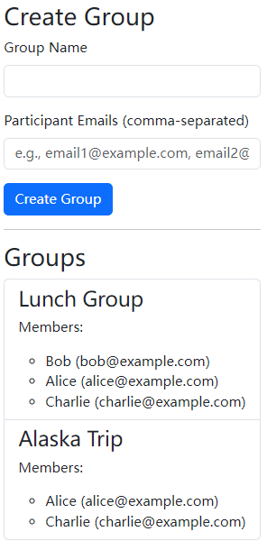
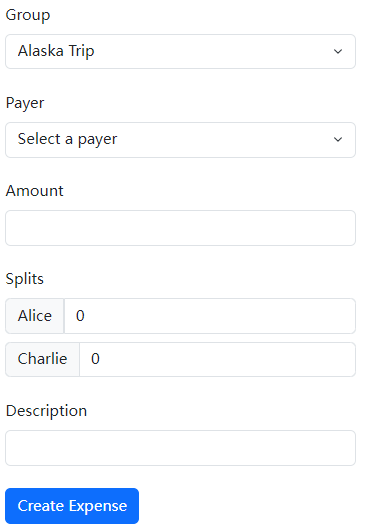
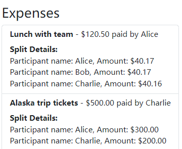
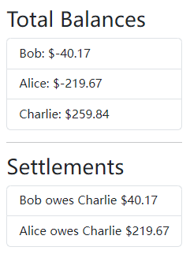
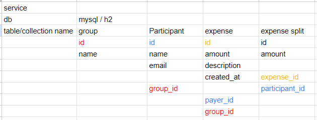

# Expense Splitter Application

This application is a split-expense management system designed to help groups track shared expenses and settle debts between participants. It consists of a backend implemented in Java with Spring Boot and a frontend implemented in React.

## Features

1. **Participant Management**:

   - Add participants with name and email.
   - Display a list of all participants.

   

2. **Group Management**:

   - Create groups and add participants to them.
   - Display group information, including participants.

   

3. **Expense Management**:

   - Create expenses with descriptions, amounts, and splits.
   - Select a group, payer, and allocate expense splits among participants.

   

4. **Balances Page**:

   - View net balances for each participant.
   - Display settlements indicating who owes whom and how much.

   

## How to Run

### Prerequisites

- **Backend**: Java 17+, Maven, Spring Boot
- **Frontend**: Node.js, npm/yarn

### Steps

1. **Run the Backend**:

   - Navigate to the backend folder. Start the backend:

     ```
     mvn spring-boot:run
     ```

2. **Run the Frontend**:

   - Navigate to the frontend folder. Install dependencies:

     ```
     npm install
     ```

   - Start the frontend:

     ```
     npm run dev
     ```

3. **Access the Application**:

   - Click the link in the terminal to open application.

## Data Modeling

### Entity Relationships



1. **Group and Participant**:
   - **Type**: Many-to-Many
   - **Join Table**: `group_participants`
   - **Description**: A group can have multiple participants, and a participant can belong to multiple groups.
2. **Expense and Group**:
   - **Type**: Many-to-One
   - **Description**: An expense is linked to a specific group.
3. **Expense and ExpenseSplit**:
   - **Type**: One-to-Many
   - **Description**: Each expense has multiple splits, representing how the expense is divided among participants.
4. **ExpenseSplit and Participant**:
   - **Type**: Many-to-One
   - **Description**: Each split is assigned to a specific participant.

## Database Configuration

- **Default Database**: In-memory H2 database is used for quick setup and testing. It is prepopulated with sample data.
- **MySQL**: To use MySQL, create database in local Mysql named `expense_splitter`. Then change the username and password in the `application-mysql.properties` file.  Pass `-Dspring.profiles.active=mysql` when running the application.

## Architecture

### Backend

- **Data Layer**: Entities represent tables in the database.
- **Service Layer**: Contains business logic, including balance and settlement calculations.
- **Controller Layer**: Provides RESTful APIs for frontend interaction.
- **DTOs**: Simplify data transfer between layers, ensuring clean separation of concerns.

### Frontend

- **Components**: Reusable UI components for forms, lists, and navigation.
- **Pages**: Serve as views containing specific functionalities, e.g., `ExpensesPage` for managing expenses.
- **Services**: Centralized API service using Axios for clean and consistent backend communication.

## Workflow

1. **Backend**:
   - Data is prepopulated using `DataInitializer`.
   - Participants, groups, and expenses are persisted in the database.
   - REST APIs allow CRUD operations and balance/settlement calculations.
2. **Frontend**:
   - API calls fetch data from the backend.
   - Components dynamically render forms and lists based on API responses.
   - State is managed using React hooks (`useState`, `useEffect`).

## Debt Settlement Calculation

1. **Overview**:

   - The goal of debt settlement is to minimize the transactions needed to settle balances between participants.
   - Each participant has a net balance calculated as the total amount they owe or are owed, derived from the group's expenses and splits.

2. **Settlement Algorithm**:

   - Divide participants into two lists:
     - **Payers**: Participants with negative balances (those who owe money).
     - **Recipients**: Participants with positive balances (those who are owed money).
   - Greedy Algorithm. Match participants with the largest positive (recipients) and negative balances first. Every transaction resolves as much debt as possible between two participants.

3. **Example**:

   Initial Balances:

   - Alice: -$60
   - Bob: +$70
   - Charlie: -$30
   - Dave: +$20

   Transactions:

   1. Alice pays Bob $60:
      - Alice: $0, Bob: +$10
   2. Charlie pays Bob $10:
      - Charlie: -$20, Bob: $0
   3. Charlie pays Dave $20:
      - Charlie: $0, Dave: $0
