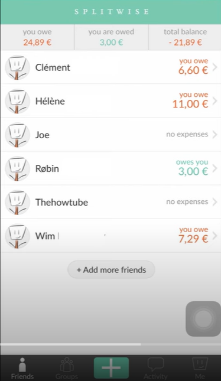
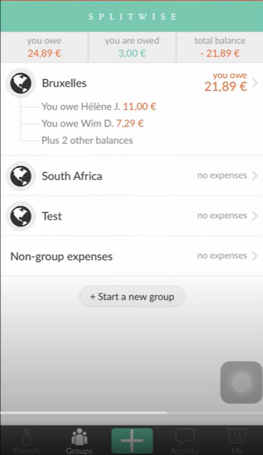
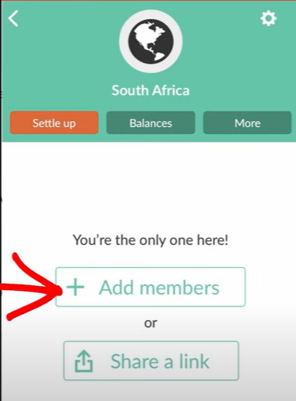
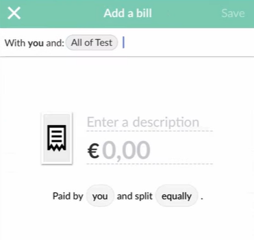
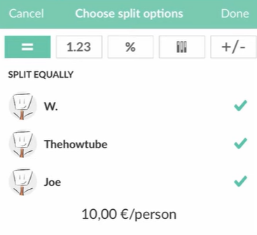

# 11.21


no user account and login, no security and filter

settle debts should be inside known friends. Larger than one single group, smaller than all users. If too complicated, restrict transaction within groups. 

## Project Structure

### Backend

```
java
├── com.example.demo
│   ├── config
│   │   ├── CorsConfig          # CORS configuration for API access
│   │   ├── DataInitializer     # Initializes default data into the database
│   ├── controller
│   │   ├── ExpenseController   # Handles API requests for expenses
│   │   ├── GroupController     # Handles API requests for groups
│   │   ├── ParticipantController # Handles API requests for participants
│   ├── dto
│   │   ├── ExpenseDTO          # Data Transfer Object for expenses
│   │   ├── GroupDTO            # Data Transfer Object for groups
│   │   ├── ParticipantDTO      # Data Transfer Object for participants
│   ├── model
│   │   ├── Expense             # Entity representing an expense
│   │   ├── ExpenseSplit        # Entity representing an expense split
│   │   ├── Group               # Entity representing a group
│   │   ├── Participant         # Entity representing a participant
│   ├── repository
│   │   ├── ExpenseRepository   # Repository for accessing expenses
│   │   ├── GroupRepository     # Repository for accessing groups
│   │   ├── ParticipantRepository # Repository for accessing participants
│   ├── service
│   │   ├── ExpenseService      # Business logic for expenses
│   │   ├── GroupService        # Business logic for groups
│   │   ├── ParticipantService  # Business logic for participants
│   ├── DemoApplication         # Spring Boot entry point
resources
│   ├── static                  # Static assets (if needed)
│   ├── templates               # Templates (if needed)
│   ├── application.properties  # Spring Boot configuration
```

### Frontend

```
src
├── assets                      # Static assets
├── components
│   ├── ExpenseForm.jsx         # Form to create an expense
│   ├── ExpenseList.jsx         # List displaying all expenses
│   ├── GroupForm.jsx           # Form to create a group
│   ├── GroupList.jsx           # List displaying all groups
│   ├── Navbar.jsx              # Navigation bar
│   ├── ParticipantForm.jsx     # Form to create a participant
│   ├── ParticipantList.jsx     # List displaying all participants
├── pages
│   ├── ExpensesPage.jsx        # Page for managing expenses
│   ├── GroupsPage.jsx          # Page for managing groups
│   ├── HomePage.jsx            # Landing page (optional)
│   ├── NotFoundPage.jsx        # 404 error page
│   ├── ParticipantsPage.jsx    # Page for managing participants
├── services
│   ├── api.jsx                 # Axios API service for backend interaction
├── App.css                     # Application-wide CSS
├── App.jsx                     # Main React component with routing
├── index.css                   # CSS for global styles
├── main.jsx                    # React entry point
```

Hi Yi Chen,

Thank you for your time during the interview yesterday. I appreciate your patience and for listening to my thoughts on the architecture.

I’ve completed the project with Spring Boot and React today and attached the source code. Looking back, implementing a minimal version with local files and command-line interaction would have been more efficient. Now, the project includes H2 as an in-memory database to simplify setup. Or you can take a look at README.md, where has screenshots for frontend.

Reflecting on our discussion about Hibernate column update strategies, I learned that its schema update won't delete existing data, so it supports adding columns, but doesn't delete columns. It also doesn't handle complex migrations like changing data types. It was an insightful topic, thanks for bringing it up.

I’ve added you on LinkedIn and hope we can stay connected. I'd be excited about future opportunities to work together.

Thank you again.

Best regards,

Mary Yang

## Purpose of DTOs

- **Separation of Concerns**: DTOs decouple the database entities from the frontend.
- **Data Validation**: Validate and sanitize data before persisting or returning it.
- **Security**: Prevent unnecessary fields (e.g., passwords) from being exposed.


- hibernate update strategy?

**Non-destructive changes**: It will attempt to make schema changes without deleting existing data.

**Additive changes**: It supports adding new columns or tables.

**Field removal**: It won't automatically delete fields from the database; it just stops using them.

**Migration gaps**: Complex changes like renaming columns, changing data types, or reorganizing tables are **not handled**.


Design and implement a simplified command-line **Expense Splitter** application that helps users divide expenses among a group of people. The application should allow users to record expenses, associate them with participants, and calculate how much each person owes or is owed.

**Requirements:**

1. **Expense Management Features:**

  - **Create Group:**

  - - Allow users to create a new group by entering the names of participants.

  - **Add Expense:**

  - - Enable users to add expenses with details such as amount, description, payer, and participants involved.
    - Support splitting expenses equally or unequally among participants.

  - **View Expenses:**

  - - Display a list of all recorded expenses with their details.

  - **Calculate Balances:**

  - - Compute and display the net balance for each participant, showing who owes money and who should receive money.

  - **Settle Debts:**

  - - Provide suggestions on how participants can settle debts among themselves.

2. **Data Storage:**

  - **Persistence:**

  - - Store all data (groups, participants, expenses, balances) in a local file using a format like JSON or CSV.
    - Load existing data when the application starts.
    - Ensure data is saved after each operation to prevent data loss.

3. **User Interface:**

  - **Menu Navigation:**

  - - Implement a text-based menu to navigate through different functionalities such as creating a group, adding expenses, viewing balances, and exiting the application.

  - **User Prompts:**

  - - Provide clear instructions and prompts for user inputs.
    - Display confirmation messages after successful operations.

4. **Error Handling and Validation:**

  - **Input Validation:**

  - - Ensure that numerical inputs (like amounts) are valid numbers.
    - Validate that required fields are not left empty.
    - Check that the payer and participants exist within the group.

  - **Exception Handling:**

  - - Handle errors gracefully, such as file read/write errors or invalid data formats, without crashing the application.

5. **Code Organization:**

  - **Modularity:**

   - - Use functions or classes to separate different parts of the application (e.g., data handling, calculations, user interface).

   - **Readability:**

   - - Write clean and readable code with appropriate variable names and comments explaining key sections or complex logic.


## splitwise





settle up: 还钱









#11.14

2016. 8 years

Profitable by next year.

Build trains. Crossroads. 

Operating system. Popluar. 20% share of the marketing.

 

Coding interview. Toy project.

 

\-    AI product.

\-    Operating system. Rail station.

Comprehensive.

 

Swedan.


Intro

My name is MY. I have 1.5 years of industry experience as a software developer, 2 years of academic experience during my master’s at UW, and 1 year as a product manager.

I started my career as a product manager that designs AI workflow platform. I quickly gained experience with the full software development lifecycle, collaborated with 150+ people and summarized customer needs. This foundation helped me transit into software development, and I completed my Master’s in CS at the University of Washington.

In my most recent role as a Software Engineer at Beaconfire, I developed a statistical tool to process over 10 million daily stock transactions using **React.js**, **Spring Boot**, and **MongoDB**. I saved 20% in tax costs by building features for joint tax filing and custom deductions.

During my freelance role at Biodepot, I built data processing pipelines from scratch with Java and Spark. I containerized services with **Docker** and deployed them to **Kubernetes**.

I understand that this senior software engineer position requires familiarity with front-end frameworks like React, OOP language like Java, and a strong foundation in **database design and optimization** for both relational and NoSQL databases. My experience aligns well with these requirements.

I’m confident I can effectively contribute to your team.

 